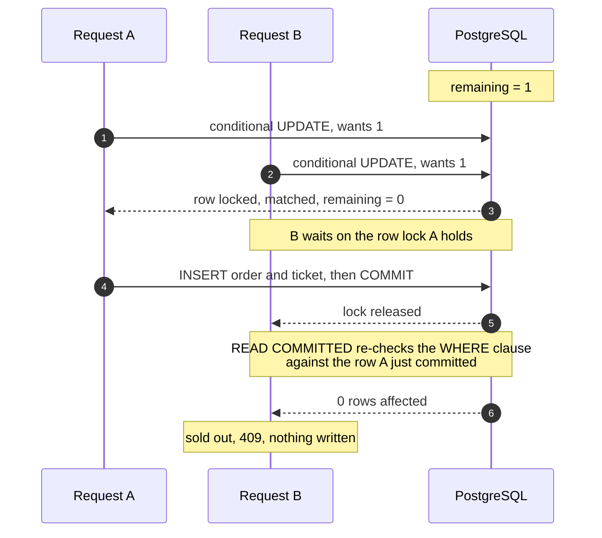
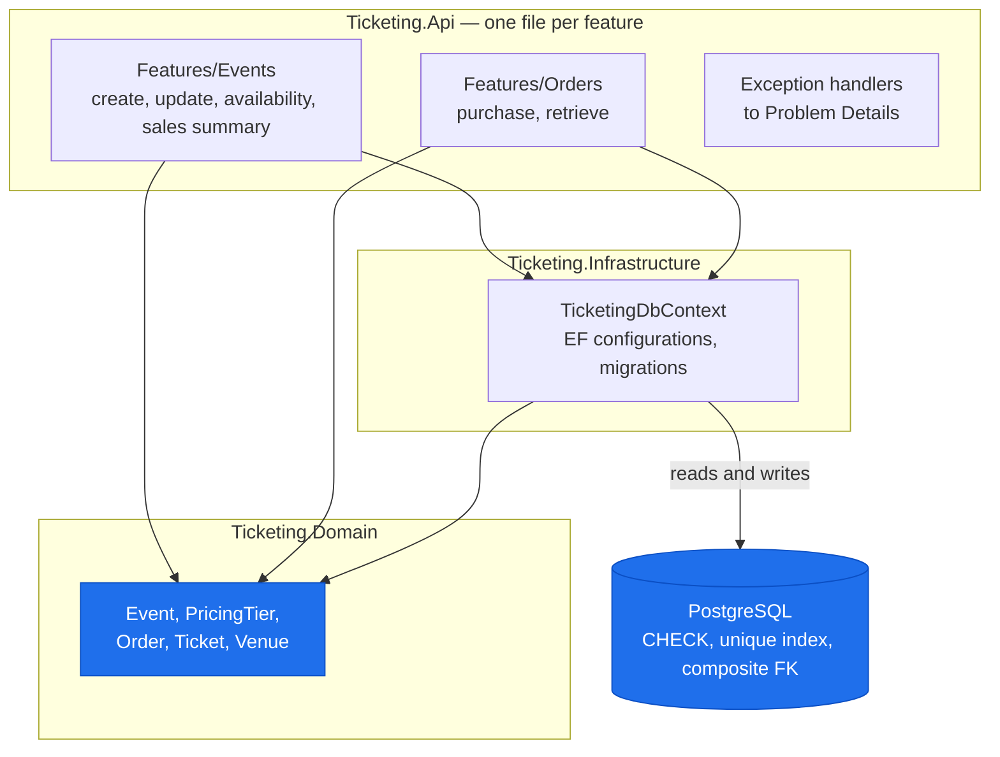
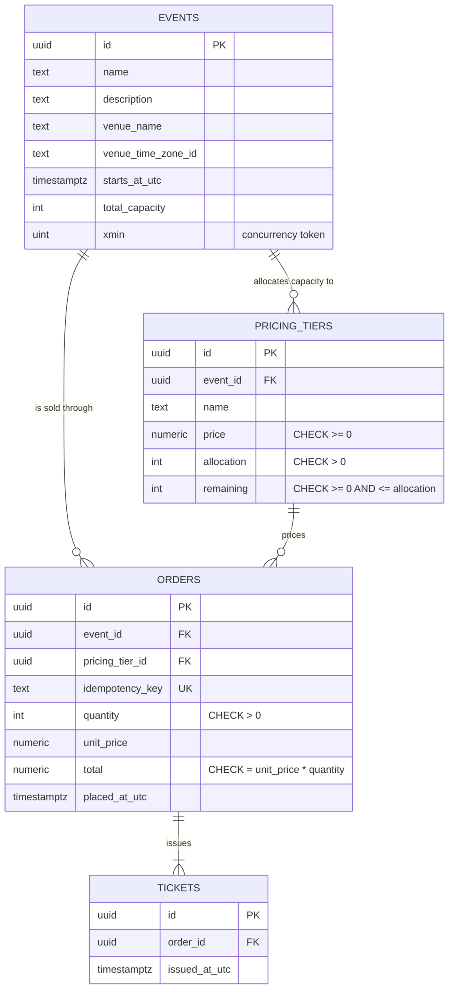

# Event Ticketing API

A REST API for creating events, selling tickets against fixed pricing tiers, and
reporting on sales. .NET 10, PostgreSQL, EF Core code-first.

---

## Run it

You need the [.NET 10 SDK](https://dotnet.microsoft.com/download) and Docker.

```
docker compose up -d
dotnet ef database update --project src/Ticketing.Infrastructure
dotnet run --project src/Ticketing.Api
```

That is the whole setup. The browser opens on **<http://localhost:5076/scalar/v1>**,
an executable API reference generated from the code.

<details>
<summary>If <code>dotnet ef</code> is not installed</summary>

```bash
dotnet tool install --global dotnet-ef
```

</details>

<details>
<summary>If something already holds port 5432</summary>

Pick a free port and tell all three steps about it. Bash:

```bash
export PORT=5433
TICKETING_DB_PORT=$PORT docker compose up -d
TICKETING_DB="Host=localhost;Port=$PORT;Database=ticketing;Username=ticketing;Password=localdev" \
  dotnet ef database update --project src/Ticketing.Infrastructure
dotnet user-secrets set "ConnectionStrings:Ticketing" \
  "Host=localhost;Port=$PORT;Database=ticketing;Username=ticketing;Password=localdev" \
  --project src/Ticketing.Api
```

PowerShell:

```powershell
$env:TICKETING_DB_PORT = "5433"
docker compose up -d
$env:TICKETING_DB = "Host=localhost;Port=5433;Database=ticketing;Username=ticketing;Password=localdev"
dotnet ef database update --project src/Ticketing.Infrastructure
dotnet user-secrets set "ConnectionStrings:Ticketing" $env:TICKETING_DB --project src/Ticketing.Api
```

`TICKETING_DB` redirects the EF tooling; user secrets redirect the running API, and
override `appsettings.Development.json` without changing a committed file.

</details>

Migrations are a deployment step, not a startup step: `dotnet ef database update` is a
command you run. The application never migrates itself.

---

## Run the tests

```bash
dotnet test
```

The Docker daemon must be running. Nothing else needs to be —
[Testcontainers](https://testcontainers.com/) starts its own PostgreSQL container on a
random port, migrates it, and destroys it afterwards. A clean clone goes green with one
command.

---

## Try it with real data

Two scripts under [`demo/`](demo/). Both go through the public API, so anything they
create is data the system considers valid.

```powershell
.\demo\seed.ps1        # three events with tiers, and orders against two of them
.\demo\oversell.ps1    # 200 concurrent buyers, 50 tickets, live
```

`seed.ps1` prints the ids it created. One event is left with no sales, so the sales
summary can be seen returning zeroes rather than a 404.

`oversell.ps1` fires far more concurrent purchases than there are tickets, then checks
the outcome three ways — the HTTP responses, the sales summary, and availability:

```text
  201 Created      50   tickets issued
  409 Conflict    150   told the tier was sold out

  allocation       50
  sold             50   (from the sales summary)
  remaining         0   (from availability)

  INV-1 holds: exactly 50 tickets issued, no more.
```

It then prints an `UPDATE` to run in `psql`, to try the same thing from underneath the
application:

```text
ERROR:  new row for relation "pricing_tiers" violates check constraint
        "ck_pricing_tiers_remaining_non_negative"
```

[`demo/api.http`](demo/api.http) walks every endpoint in order, each request labelled
with the acceptance criterion it demonstrates, including the ones meant to fail. It
needs Visual Studio 2022+ or the REST Client extension for VS Code.

The scripts are PowerShell, so on macOS or Linux they need
[PowerShell 7](https://github.com/PowerShell/PowerShell). `dotnet test` proves the same
concurrency property on any platform with no extra install.

To start again from an empty database:

```
docker compose down -v
docker compose up -d
dotnet ef database update --project src/Ticketing.Infrastructure
```

---

## Not overselling

Every purchase decrements the tier's remaining count with a single conditional
`UPDATE`:

```sql
UPDATE pricing_tiers
   SET remaining = remaining - @quantity
 WHERE id = @tierId
   AND remaining >= @quantity;
```

There is no read-then-write, so there is no window for a second request to slip into.
**Zero rows affected is the sold-out answer** — not an error to interpret, just the
outcome.

One ticket left, two buyers:



The step that carries the design is the one after B's lock is released. Under
PostgreSQL's default `READ COMMITTED`, a statement that blocked on a row lock
re-evaluates its `WHERE` clause against the newly committed row rather than resuming
with the value it read before waiting. B matches nothing.

### The second line of defence

The schema does not depend on the code being right:

```sql
CONSTRAINT ck_pricing_tiers_remaining_non_negative CHECK (remaining >= 0)
```

An oversold row cannot exist in the table, whatever code runs against it. One
invariant, two mechanisms.

### Idempotency takes the same shape

`POST /v1/events/{id}/orders` requires an `Idempotency-Key`. Uniqueness is enforced by
a unique index rather than a check-then-insert, which would race in the same way an
oversell does. The losing request rolls back — undoing its own decrement — and returns
the original order.

### The test that has to pass

`tests/Ticketing.IntegrationTests/PurchaseTests.cs` fires concurrent purchases at a
tier with fewer tickets than buyers, each with its own idempotency key, and asserts
both that `remaining` lands on zero **and** that exactly the allocated number of ticket
rows exist. A tier reading zero while too many tickets exist is still an oversell.

Reasoning: [ADR-0001](docs/adr/0001-conditional-update-for-inventory.md).

---

## API

| Method | Route | Success | Notable failures |
|---|---|---|---|
| `POST` | `/v1/events` | 201 + `Location` | 422 |
| `GET` | `/v1/events` | 200 | — |
| `GET` | `/v1/events/{id}` | 200 | 404 |
| `PUT` | `/v1/events/{id}` | 200 | 404, 412, 422 |
| `DELETE` | `/v1/events/{id}` | 204 | 404, 409 |
| `GET` | `/v1/events/{id}/availability` | 200 | 404 |
| `POST` | `/v1/events/{id}/orders` | 201 + `Location` | 404, 409, 422 |
| `GET` | `/v1/events/{id}/sales-summary` | 200 | 404 |
| `GET` | `/v1/orders/{orderId}` | 200 | 404 |

Errors are [RFC 9457](https://www.rfc-editor.org/rfc/rfc9457) Problem Details, each
carrying a `traceId` that also appears in the logs.

- **400** — it did not parse
- **422** — it parsed and broke a business rule
- **409** — it is valid, but conflicts with the world as it is right now

There is no authentication; the brief does not ask for it. The consequence is
deliberate: possession of the order id is what authorizes reading it, which is why ids
are UUIDs rather than sequential integers.

### Two health checks

| | Question | If it fails |
|---|---|---|
| `/health/live` | Is this process still working? | Kill and restart the instance |
| `/health/ready` | Can this instance serve a request right now? | Take it out of the load balancer, leave it running |

`/health/live` runs no checks at all. `/health/ready` checks the database. The rule:
liveness checks only what a restart could fix; readiness checks everything a request
needs.

---

## How it is put together

Every arrow means **"references"** — a compile-time project dependency, not a flow of
data. They are one-way on purpose, and the direction is the design.



`Ticketing.Domain` references nothing — no other project, no packages.

Inside the API the organisation is **vertical slices**: a feature is one file holding
its request, its response and its handler. Reading a feature means opening one file.

```text
src/Ticketing.Domain               entities and the rules that hold without a database
src/Ticketing.Infrastructure       DbContext, EF configurations, migrations
src/Ticketing.Api                  one file per feature, endpoint to database
tests/Ticketing.UnitTests          domain rules, no I/O
tests/Ticketing.IntegrationTests   every AC, over HTTP, against real PostgreSQL
docs/spec.md                       invariants, stories, acceptance criteria
docs/adr/                          the decisions that had a real alternative
```

### The data model



Four details are deliberate:

- **The foreign key from `orders` is composite** — `(pricing_tier_id, event_id)`
  references `pricing_tiers (id, event_id)`. An order pointing at a tier from a
  different event is unrepresentable rather than merely invalid.
- **`total = unit_price * quantity` is a `CHECK`**, and `unit_price` is copied onto the
  order at purchase time, so a historical order stays correct after a price change.
- **`xmin`** is a PostgreSQL system column, used as the concurrency token behind
  `If-Match` on event updates.
- **Money is `numeric(12,2)`** and `decimal` in C#, never floating point.

Deletes differ on purpose: tiers and tickets cascade, orders `RESTRICT`. Deleting an
event that has sold tickets returns 409 rather than erasing the record of money taken.

---

## Decisions

[`docs/spec.md`](docs/spec.md) holds the invariants, stories and acceptance criteria.
It was written before the code and carries an amendments log.

| ADR | Decision |
|---|---|
| [0001](docs/adr/0001-conditional-update-for-inventory.md) | Conditional `UPDATE` for inventory, with a `CHECK` constraint behind it |
| [0002](docs/adr/0002-separate-read-models-not-cqrs.md) | Separate read models, one database — not event sourcing |
| [0003](docs/adr/0003-no-payment-and-no-held-reservations.md) | Sell outright; no payment, no held reservations |
| [0004](docs/adr/0004-real-postgresql-in-tests.md) | Real PostgreSQL in tests, never an in-memory provider |

---

## What I did not build

Named deliberately rather than left to be discovered. The full table, with what would
replace each one, is in [`docs/spec.md`](docs/spec.md).

| Omitted | Why |
|---|---|
| Payment | Not in the brief, and a stub would misrepresent the concurrency design ([ADR-0003](docs/adr/0003-no-payment-and-no-held-reservations.md)) |
| Authentication and multi-tenancy | Not in the brief. The consequence is named above rather than glossed over |
| Held reservations | Tickets are sold outright. A cart that holds inventory needs expiry and a reaper |
| Seat selection | Turns inventory from a counter into a set — same locking strategy, different statement |
| Refunds and cancellation | The compensating half of a state machine that does not exist yet |
| A tracing backend | `traceId` flows through every response, but no collector is run |
